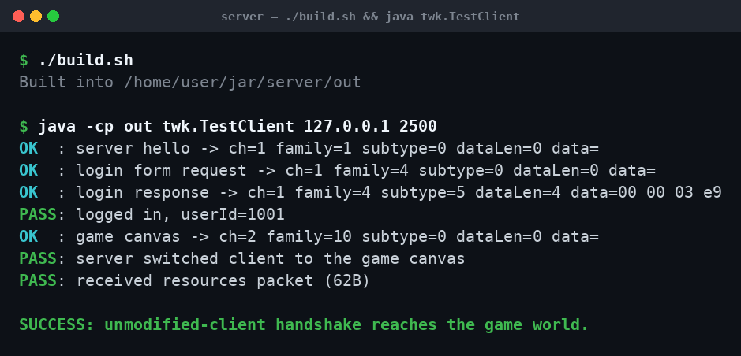
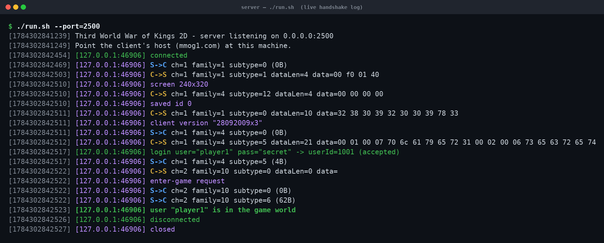
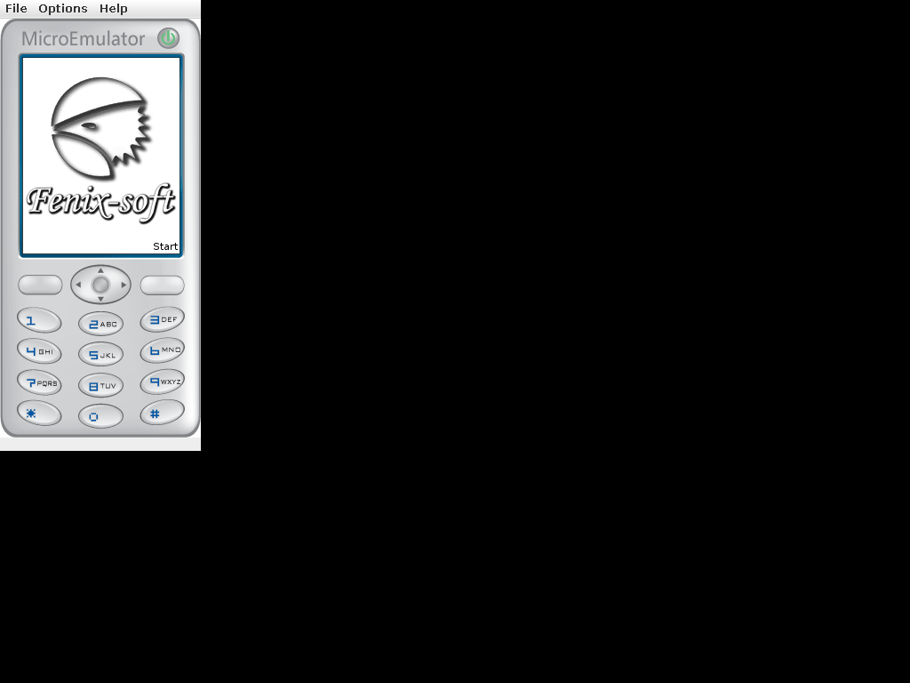

# Локальный запуск тест-сервера (на ПК)

Пошаговая инструкция: как поднять сервер у себя на ПК и подключить к нему
клиента. Рабочая **тест-версия** — это J2ME-клиент 3.0 (`.jar`): для него сервер
уже реализован и хендшейк доведён до входа в игровой мир. Android-версия (`.apk`)
идёт отдельным протоколом на порту 5005 — она в работе (см. раздел в конце).

---

## 0. Что нужно

- **JDK** (Java 8+). Проверка: `java -version` и `javac -version`.
- Папка `server/` из этого репозитория.
- Для визуального запуска клиента — J2ME-эмулятор: **Microemulator** (кроссплатформенный,
  на Java) или **KEmulator** (Windows). Для проверки самого сервера эмулятор не нужен.

---

## 1. Собрать сервер

```sh
cd server
./build.sh        # Windows: build.sh через Git Bash, или: javac -d out src/twk/*.java
```
Скомпилируется в `server/out`.

## 2. Запустить сервер

```sh
./run.sh          # или: java -cp out twk.ThirdWorldServer --port=2500
```
Сервер слушает `0.0.0.0:2500` (это порт, зашитый в J2ME-клиенте) и в консоль
пишет каждый пакет в обе стороны. Флаги:
- `--port=2500` — порт.
- `--no-resources` — не слать стартовый пакет ресурсов.

## 3. Проверить сервер без эмулятора (быстро)

В отдельном терминале:
```sh
java -cp out twk.TestClient 127.0.0.1 2500
```
Это протокольный тест — он повторяет точные байты настоящего клиента и проходит
весь хендшейк. Ожидаемый результат — `SUCCESS: ... reaches the game world`.



## 4. Подключить настоящий J2ME-клиент

Клиент зашит на хост `mmog1.com:2500`. Клиент **не меняем** — только перенаправляем
хост на свой ПК.

**Перенаправление хоста** (файл hosts на машине с эмулятором):
- Linux/macOS: `/etc/hosts`
- Windows: `C:\Windows\System32\drivers\etc\hosts`

Добавить строку:
```
127.0.0.1   mmog1.com
```

**Запуск клиента в Microemulator:**
```sh
java -cp microemulator-2.0.4.jar org.microemu.app.Main Third_World_War_of_Kings_2D.jar
```
Если Microemulator ругается на манифест старого `.jar` — пересобери манифест
(оставив строку `MIDlet-1: ThirdWorld, /ico.png, com.fenix.main.Main`) или используй
KEmulator.

В окне эмулятора выбери MIDlet **ThirdWorld** и нажми **Start**.

## 5. Что должно произойти

В консоли сервера видно, как реальный клиент проходит хендшейк: коннект →
hello → версия `28092009x3` → форма логина → логин принят → вход в игру.



Клиент в эмуляторе показывает загрузочный логотип Fenix-soft и уходит на форму
логина (любой логин/пароль принимаются — сервер заводит аккаунт на лету).



---

## Кратко: команды

```sh
cd server
./build.sh
./run.sh                              # сервер на 2500
java -cp out twk.TestClient 127.0.0.1 2500   # проверка протокола
```

---

## Android-версия (`.apk`) — в работе

Android-сборка использует **другой протокол на порту 5005** (тип-байт → обработчик),
не тот FLAP, что в J2ME. Под неё:

1. Снимаем реальный трафик инструментированным `ThirdWorld_tap.apk` (пишет
   `/sdcard/Download/twk_c2s.bin` и `twk_s2c.bin`) — он ходит на настоящий сервер.
   Либо прокси-сниффером на ПК:
   ```sh
   java -cp out twk.ProxyServer --port=5005 --upstream=mmog1.com:5005 --dump=cap
   ```
2. По дампам восстанавливается протокол и пишется сервер на 5005.

Пока сервер под Android не готов — рабочая тест-версия это J2ME (`.jar`) на 2500.
